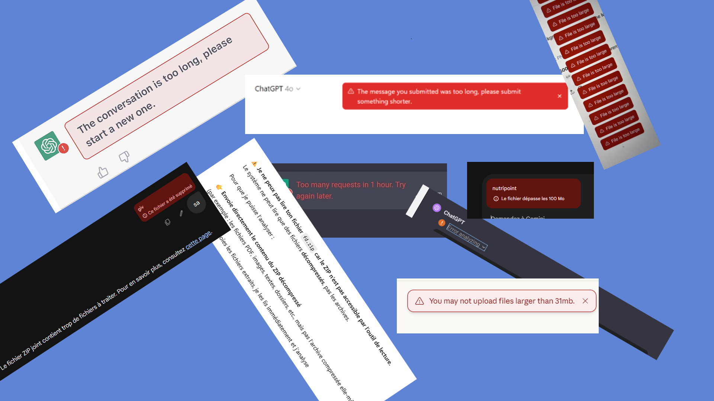
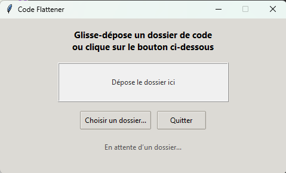
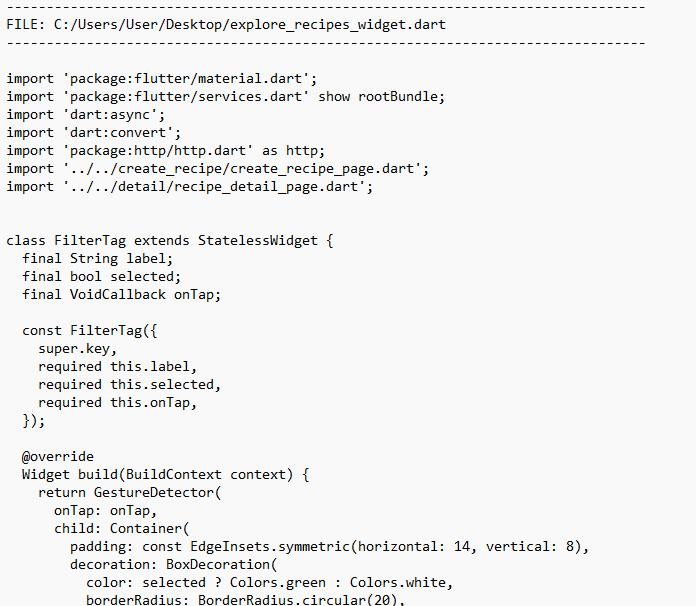

# EatMyTxt

EatMyTxt was created with one very clear mission: to shut up any AI that keeps pretending it “can’t analyze your code”, “doesn’t have enough context”, or starts inventing imaginary errors out of thin air.  
This tool wipes out all excuses instantly.

EatMyTxt takes your entire project – every folder, every file, every line – and rebuilds one giant text file that includes the exact file path of each piece of code.  
No hiding. No missing files. No bullshit.

---

## What EatMyTxt Actually Does

EatMyTxt performs three brutal and very straightforward actions:

1. It scans your whole project recursively
2. It reads every file and records its full, precise path
3. It generates one massive text file that contains:
   - The full file path
   - The filename
   - The complete code inside
   - Clean spacing so even a lazy AI can follow the structure

Result: no AI can say “I don’t understand”, “I’m missing a file”, “I don’t have enough context”, or “I can’t open your zip boohoo”.  
No stupid 37 MB limits.  
No “your archive is too big”.  
No “I couldn’t load your project”.  
They can read. That’s already good enough. EatMyTxt does the rest.

---

## User Interface

The interface is intentionally simple and direct.  
You select your project folder, click one button, and BOOM: a single giant text file that even the laziest AI can’t ignore.

No excuses.  
No errors.  
No crying about missing context.

---

## Example Output

The final file is clean, readable, structured, and absolutely impossible to misinterpret.  
Paths included.  
Files included.  
Code included.  
Nothing left for the AI to complain about.

---

## Why Use EatMyTxt

- To flatten your entire project into one unmissable text file
- To stop AIs from inventing imaginary errors
- To ensure nothing is ever “missing”
- To send your project anywhere without compression
- To produce a readable backup of your entire codebase
- To make damn sure the machine on the other side can’t pretend it lacks context

---

## The Promise of EatMyTxt

With EatMyTxt, your AI will never again be able to say “I don’t have enough context” or “I can’t open your project”.

Never.

If it still screws up with the whole project right in its face, that’s on the AI, not on you.
